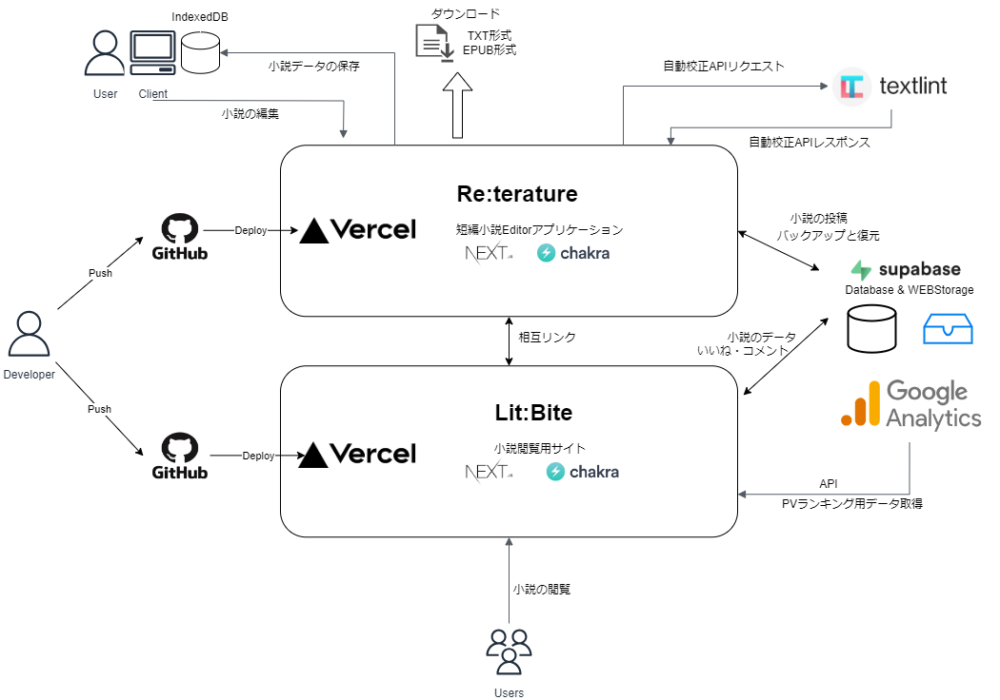

### About Lit:Bite

- This is a web application that allows you to browse novels submitted from **[Re:terature](https://novel-editor-ver2.vercel.app/)**!
- [GitHub repository for Re:terature](https://github.com/dende-h/novel_editor_ver2)
- This is a site for short stories of 24,000 words or less. You can enjoy it in your spare time.
- Like buttons and favorites are recorded in browser storage, so you can use them on different devices.
- Register your favorite authors and you can view a list of their works right away!
- You can display them randomly, so you may come across a wonderful work of art by chance.
- All can be viewed free of charge with no user registration or login required.
- You can leave a comment. You can support the author by sending your comments of support.
- Recommended browser is Chrome or Brave. You can use it like a native application by pasting short shortcodes.

### Technology Stacks

- Language: TypeScript
- Framework: Next.js
- Style framework: ChakraUI
- State management：Recoil
- Cloud DB：supabase

See package.json for version

### Architecture

### Link to the actual application

**[Lit:Bite](https://next-novel-site.vercel.app/)**
